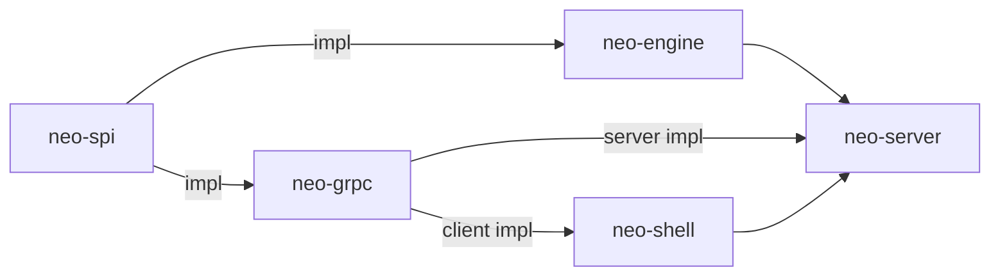

## Nightly Build Packages

- [machbase-neo docs](https://neo.machbase.com/)

### Build dependency

```mermaid
flowchart LR

SPI[neo-spi] -->|impl| E
SPI-->|impl|R

E[neo-engine]
E --> S[neo-server]

R -->|server impl| S

R[neo-grpc] -->|client impl| SH[neo-shell]
SH --> S

```