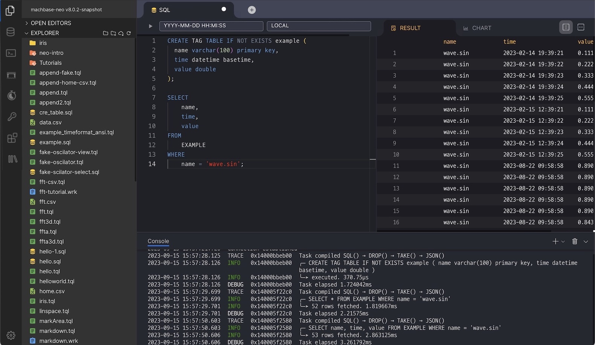
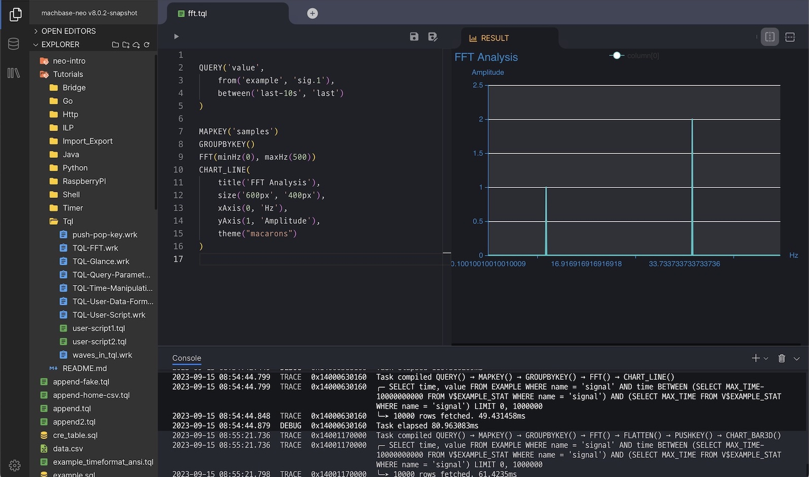
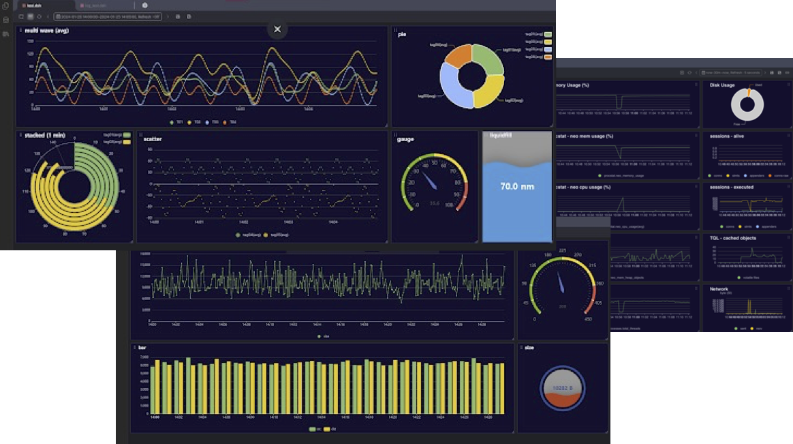
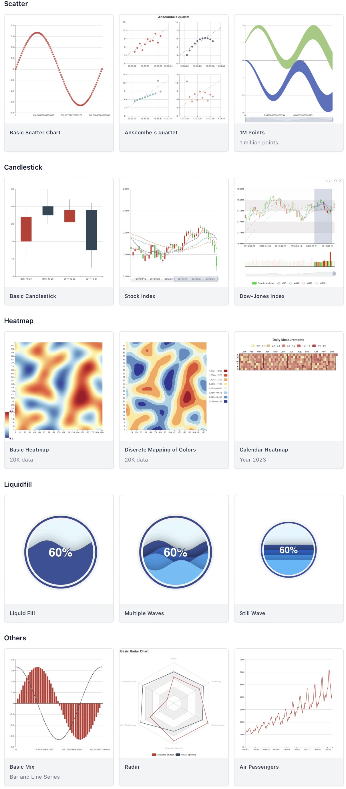

[](https://github.com/machbase/neo-server/releases)
[](https://github.com/machbase/neo-server/actions/workflows/ci-main.yml)
[](https://codecov.io/gh/machbase/neo-server)

# neo-server

Machbase is the fastest time-series database for [IoT in the world](https://www.tpc.org/tpcx-iot/results/tpcxiot_perf_results5.asp?version=2) implemented in C++. 
`machbase-neo` is an IoT Database Server that embedding the Machbase engine and provides essential and convenient features to build IoT platforms such as MQTT and HTTP API. It can be installed on machines ranging from Raspberry PI to high-performance servers.

API and Interfaces

- [x] HTTP : Applications and Sensors read/write data via HTTP REST API
- [x] MQTT : Sensors write data via MQTT protocol
- [x] gRPC : The first class API for extensions
- [x] SSH : Command line interface for human and batch process
- [x] WEB UI (Batteries included)
- [x] [UI API](https://docs.machbase.com/neo/api-http/ui-api) to build custom UI (Batteries replaceable)

Bridges integrated with external systems

- [x] SQLite
- [x] PostgreSQL
- [x] MySQL
- [x] MS-SQL
- [x] MQTT Broker

## Documents

[https://docs.machbase.com/neo](https://docs.machbase.com/neo)

## Install Prebuilt Binary

- Download

```sh
sh -c "$(curl -fsSL https://docs.machbase.com/install.sh)"
```

- Unzip the archive file

## Install Using Docker

```sh
docker pull machbase/machbase-neo
```

https://hub.docker.com/r/machbase/machbase-neo

## Build from sources

- Install Go 1.20 or higher
- Require C compiler and linker (e.g: gcc) 
- Checkout machbase/neo-server
- Execute `go run mage.go install-neo-web` to download web-ui package
- Execute `go run mage.go machbase-neo` to build machbase-neo
- Find the executable binary from `./tmp/machbase-neo`

## Web User Interface

- SQL


- TQL : Script for transforming data


- Dashboard : Data Monitoring


- Data Visualization<br/>
Find more samples from the [documents](https://docs.machbase.com/neo/tql/chart/).

