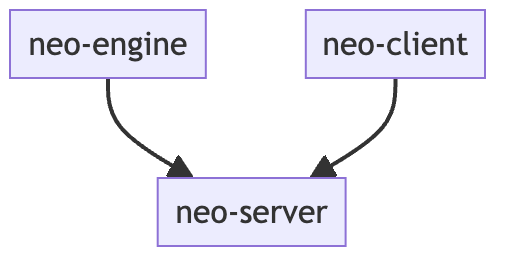

# neo-server

Machbase is the fastest time-series database for [IoT in the world](https://www.tpc.org/tpcx-iot/results/tpcxiot_perf_results5.asp?version=2) implemented in C++. 
`machbase-neo` is an IoT Database Server that embeded the Machbase engine and provides essential convenience features for building IoT systems such as MQTT and HTTP APIS. It can be installed on machines ranging from Raspberry PI to high-performance servers.

## Documents

- [https://neo.machbase.com](https://neo.machbase.com/)

## Build from sources

- Install Go 1.19 or higher and `make`
- Checkout machbase/neo-server
- Run `make`
- Find the executable binary `./tmp/machbase-neo`

### Dependency

- [neo-server](https://github.com/machbase/neo-server) machbase-neo source code
- [neo-spi](https://github.com/machbase/neo-spi) defines interfaces accessing database
- [neo-grpc](https://github.com/machbase/neo-grpc) implements spi accessing database via gRPC
- [neo-engine](https://github.com/machbase/neo-engine) implements spi accessing database via C API
