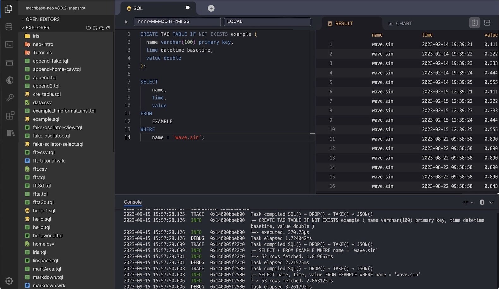
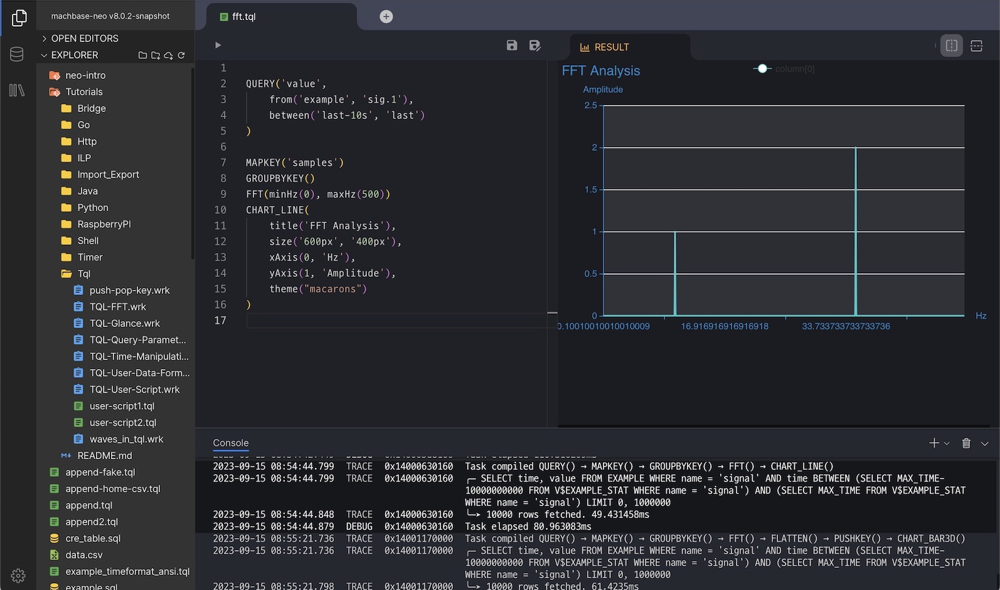
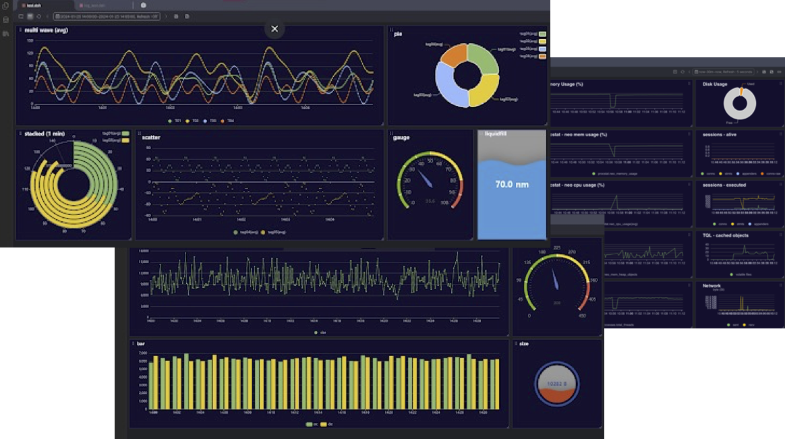
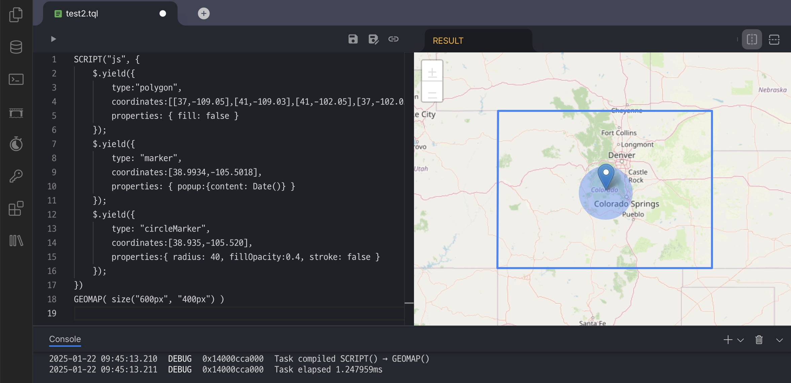
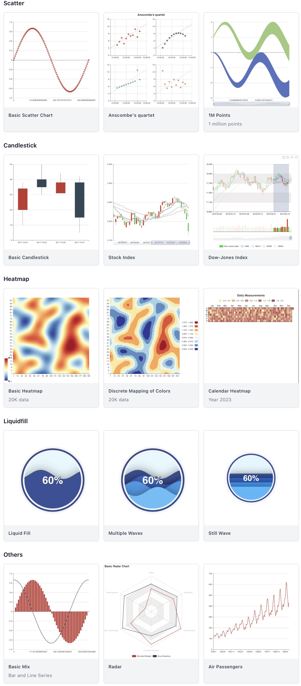

[](https://github.com/machbase/neo-server/releases)
[](https://github.com/machbase/neo-server/actions/workflows/ci-main.yml)
[](https://codecov.io/gh/machbase/neo-server)

# machbase-neo

Machbase is a blazing fast time-series database designed specifically for IoT applications and implemented in C.
Based on the high-performance Machbase database, `machbase-neo` is a data platform that offers essential and convenient features for processing large-scale time-series data,
including MQTT and HTTP APIs. It is highly versatile and can be installed on a wide range of machines,
from Raspberry Pi devices to high-performance servers.

API and Interfaces

- [x] HTTP: Applications and sensors read/write data via HTTP REST API
- [x] MQTT: Sensors write data via MQTT protocol
- [x] SSH: Command line interface for human and batch processes
- [x] WEB UI (Batteries included)
- [x] UI API to build custom UI (Batteries replaceable)
- [x] A zero-dependency Go client for building applications, available at https://github.com/machbase/neo-client

## Documents

[https://docs.machbase.com/neo](https://docs.machbase.com/neo)

## Install Prebuilt Binary

- Download

```sh
sh -c "$(curl -fsSL https://docs.machbase.com/install.sh)"
```

- Unzip the archive file

## Install Using Docker

```sh
docker pull machbase/machbase-neo
```

https://hub.docker.com/r/machbase/machbase-neo

### Deploy to Kubernetes (including air-gapped / closed networks)

[scripts/build-k8s-offline-bundle.sh](scripts/build-k8s-offline-bundle.sh) pulls the published
`machbase/machbase-neo` image, saves it as a tar archive, and generates ready-to-use Kubernetes
manifests (`Namespace`/`Service`/`StatefulSet`) plus a README under `scripts/tmp/k8s/`.

```sh
./scripts/build-k8s-offline-bundle.sh --tag v8.7.0 --registry <your-registry-host:port>
```

The `--registry` option only matters if you plan to push the image into your own private/closed-network
registry; the generated manifests' `image:` field is set to `<registry>/machbase/machbase-neo:<tag>`.
If your cluster can pull directly from Docker Hub, skip `load-image.sh` and either drop `--registry`
(it only affects the generated manifests, not the pulled/saved image itself) or edit the `image:` field
in `scripts/tmp/k8s/manifests/02-statefulset.yaml` back to `machbase/machbase-neo:<tag>` before applying.

The generated `scripts/tmp/k8s/images/load-image.sh` loads the tar and pushes it to your private
registry, and `scripts/tmp/k8s/manifests/*.yaml` can be applied with `kubectl apply -f`. See
`scripts/tmp/k8s/README.md` (generated from [scripts/build-k8s-offline-bundle.md](scripts/build-k8s-offline-bundle.md))
for the full step-by-step guide, including transferring the image into a closed network.

### Build using docker

It is recommended to build machbase-neo using a container to ensure a consistent and reproducible build environment.

- Checkout `machbase/neo-server`

- Prepare build container

```sh
docker build -t centos-build-env -f ./scripts/CentOS7.Dockerfile .
```

- Run build container

```sh
docker run --rm -v ./tmp:/app/tmp -v ./packages:/app/packages centos-build-env
```

- Find the executable binary in `./tmp/machbase-neo` and pakcage zip file in `./packages`.

## Build from Sources

- Install Go latest version
- Require a C compiler and linker (e.g., gcc)
- Checkout `machbase/neo-server`
- Execute `go run mage.go install-neo-web` to download the web-UI package
- Execute `go run mage.go install-neo-engine` to download the machbase engine
- Execute `go run mage.go machbase-neo` to build `machbase-neo`
- Find the executable binary in `./tmp/machbase-neo`

## Web User Interface

- SQL


- TQL: Script for transforming data


- Dashboard: Data Monitoring


- Geodetic Data Visualization


- Data Visualization<br/>
Find more samples in the [documents](https://docs.machbase.com/neo/tql/chart/).

