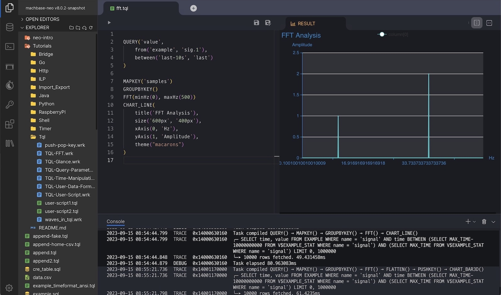

[](https://github.com/machbase/neo-server/releases)
[](https://github.com/machbase/neo-server/actions/workflows/ci-main.yml)
[](https://codecov.io/gh/machbase/neo-server)

# machbase-neo

Machbase is a blazing fast time-series database designed specifically for IoT applications and implemented in C.
`machbase-neo` is an IoT Database Server that embeds the Machbase engine and offers essential and convenient features for building IoT platforms,
including MQTT and HTTP APIs. It is highly versatile and can be installed on a wide range of machines,
from Raspberry Pi devices to high-performance servers.

API and Interfaces

- [x] HTTP: Applications and sensors read/write data via HTTP REST API
- [x] MQTT: Sensors write data via MQTT protocol
- [x] gRPC: The first-class API for extensions
- [x] SSH: Command line interface for human and batch processes
- [x] WEB UI (Batteries included)
- [x] UI API to build custom UI (Batteries replaceable)

## Documents

[https://docs.machbase.com/neo](https://docs.machbase.com/neo)

## Install Prebuilt Binary

- Download

```sh
sh -c "$(curl -fsSL https://docs.machbase.com/install.sh)"
```

- Unzip the archive file

## Install Using Docker

```sh
docker pull machbase/machbase-neo
```

https://hub.docker.com/r/machbase/machbase-neo

### Build using docker

It is recommended to build machbase-neo using a container to ensure a consistent and reproducible build environment.

- Checkout `machbase/neo-server`

- Prepare build container

```sh
docker build -t centos-build-env -f ./scripts/CentOS7.Dockerfile .
```

- Run build container

```sh
docker run --rm -v ./tmp:/app/tmp -v ./packages:/app/packages centos-build-env
```

- Find the executable binary in `./tmp/machbase-neo` and pakcage zip file in `./packages`.

## Build from Sources

- Install Go 1.23
- Require a C compiler and linker (e.g., gcc)
- Checkout `machbase/neo-server`
- Execute `go run mage.go install-neo-web` to download the web-UI package
- Execute `go run mage.go machbase-neo` to build `machbase-neo`
- Find the executable binary in `./tmp/machbase-neo`

## Web User Interface

- SQL


- TQL: Script for transforming data


- Dashboard: Data Monitoring


- Geodetic Data Visualization


- Data Visualization<br/>
Find more samples in the [documents](https://docs.machbase.com/neo/tql/chart/).

