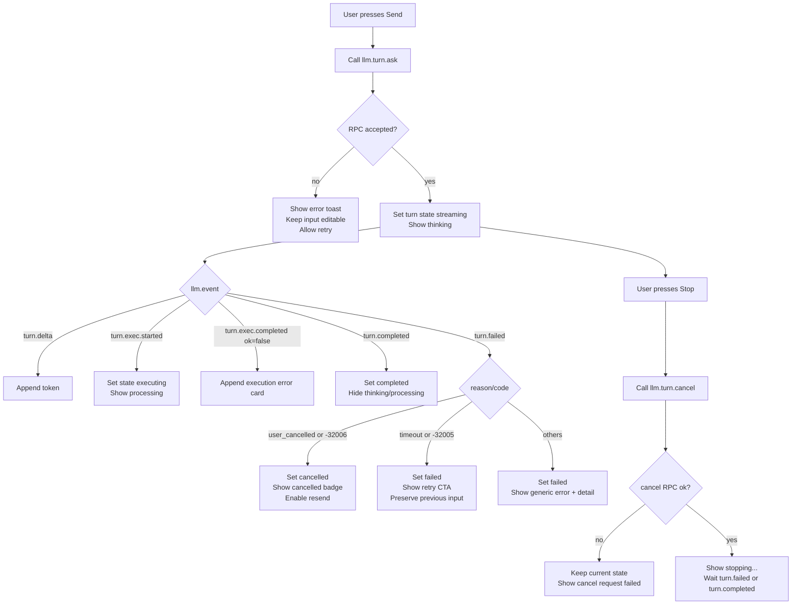

# Web AI Guide: LLM JSON-RPC Interface

이 문서는 `web-ai-demo.html`과 함께 프론트엔드 개발팀에 전달하기 위한 LLM JSON-RPC 개발 가이드입니다.

전제:
- 로그인, 세션 reset API, WebSocket 연결/운영은 이미 익숙하다고 가정합니다.
- 여기서는 **LLM 관련 JSON-RPC 인터페이스**만 설명합니다.

## 1. 범위

이 가이드는 다음을 다룹니다.
- LLM 메서드 목록과 요청/응답 형식
- `llm.event` 스트리밍 이벤트의 순서와 payload
- `turn.ask`의 실행 정책(`autoExecute`, `exec*`)과 `clientContext`
- 프론트엔드 상태머신 권장안

## 2. WebSocket JSON-RPC 프레임 구조

LLM 호출은 WS 상에서 eventbus 프레임으로 전달됩니다.

요청 프레임(`rpc_req`):

```json
{
  "type": "rpc_req",
  "session": "ui-main",
  "rpc": {
    "jsonrpc": "2.0",
    "id": 101,
    "method": "llm.turn.ask",
    "params": [ { "...": "..." } ]
  }
}
```

응답/이벤트 프레임(`rpc_rsp`):

```json
{
  "type": "rpc_rsp",
  "session": "ui-main",
  "rpc": {
    "jsonrpc": "2.0",
    "id": 101,
    "result": { "accepted": true, "status": "streaming" }
  }
}
```

`llm.event`는 동일한 `rpc_rsp`에서 `rpc.method = "llm.event"`로 push됩니다.

## 3. LLM 메서드 목록

지원 메서드:
- `llm.session.open`
- `llm.session.get`
- `llm.session.reset`
- `llm.turn.ask`
- `llm.turn.cancel`
- `llm.provider.set`
- `llm.model.set`

### 3.1 llm.session.open

요청 params[0]:

```json
{
  "sessionId": "",
  "turnId": "",
  "traceId": "",
  "payload": {
    "resume": true,
    "sessionHint": "optional-existing-session-id"
  }
}
```

응답:

```json
{
  "created": true,
  "sessionId": "sess-...",
  "sessionState": "active",
  "provider": "claude",
  "model": "claude-haiku-4-5-20251001"
}
```

`sessionState`:
- `active`: 신규 생성 또는 정상 재사용
- `restored`: reconnect grace 구간에서 복원

### 3.2 llm.session.get

요청 params[0]:

```json
{
  "sessionId": "sess-...",
  "turnId": "",
  "traceId": ""
}
```

응답:

```json
{
  "sessionState": "active",
  "provider": "claude",
  "model": "claude-haiku-4-5-20251001",
  "lastTurnId": "turn-..."
}
```

### 3.3 llm.session.reset

요청 params[0]:

```json
{
  "sessionId": "sess-...",
  "turnId": "",
  "traceId": "",
  "payload": {
    "clearHistory": true
  }
}
```

응답:

```json
{
  "reset": true,
  "sessionId": "new-sess-..."
}
```

주의:
- reset 후 sessionId가 바뀔 수 있으므로 반드시 클라이언트 상태를 갱신해야 합니다.

### 3.4 llm.provider.set / llm.model.set

`llm.provider.set` 요청:

```json
{
  "sessionId": "sess-...",
  "turnId": "",
  "traceId": "",
  "payload": {
    "provider": "claude"
  }
}
```

`llm.model.set` 요청:

```json
{
  "sessionId": "sess-...",
  "turnId": "",
  "traceId": "",
  "payload": {
    "model": "claude-opus-4-5"
  }
}
```

공통 응답:

```json
{
  "provider": "claude",
  "model": "claude-opus-4-5"
}
```

### 3.5 llm.turn.ask

핵심 메서드입니다. 응답 본문은 즉시 accept 상태를 돌려주고, 실제 출력은 `llm.event` 스트림으로 전달됩니다.

요청 params[0] 예시:

```json
{
  "sessionId": "sess-...",
  "turnId": "turn-...",
  "traceId": "trace-...",
  "payload": {
    "text": "질문 텍스트",
    "provider": "claude",
    "model": "claude-opus-4-5",
    "systemPrompt": "optional",
    "maxTokens": 0,
    "temperature": 0,

    "autoExecute": true,
    "execReadOnly": true,
    "execMaxRows": 1000,
    "execTimeoutMs": 30000,
    "execMaxOutputBytes": 65536,
    "execMaxRounds": 3,

    "clientContext": {
      "surface": "web-remote",
      "transport": "websocket",
      "renderTargets": ["markdown", "agent-render/v1", "vizspec/v1"],
      "filePolicy": "explicit-only",
      "binaryInline": false
    }
  }
}
```

즉시 응답:

```json
{
  "accepted": true,
  "status": "streaming"
}
```

중요:
- `turnId`는 클라이언트가 생성합니다. 동일 `turnId` 재요청 시 서버가 이전 응답 상태를 재사용할 수 있습니다(멱등 처리).

### 3.6 llm.turn.cancel

요청 params[0]:

```json
{
  "sessionId": "sess-...",
  "turnId": "turn-...",
  "traceId": "trace-...",
  "payload": {
    "reason": "user_requested"
  }
}
```

응답:

```json
{
  "cancelled": true
}
```

취소 이후 turn 상태는 이벤트에서 `turn.failed`(cancel reason) 또는 내부 상태 `cancelled`로 귀결될 수 있습니다.

## 4. llm.event 스트림 이벤트

이벤트는 아래 공통 필드를 갖습니다.

```json
{
  "sessionId": "sess-...",
  "turnId": "turn-...",
  "traceId": "trace-...",
  "seq": 12,
  "event": "turn.delta",
  "ts": 1710000000000,
  "payload": { "...": "..." }
}
```

### 4.1 정상 흐름(기본)

권장 처리 순서:
1. `turn.started`
2. `turn.block.started`
3. `turn.delta` (여러 번)
4. (선택) `turn.exec.started` / `turn.exec.completed` (runnable fence auto execute 시: `jsh-run`, `jsh-shell`, `jsh-sql`)
5. `turn.block.completed`
6. `turn.completed`

### 4.2 이벤트별 payload

`turn.started`:

```json
{ "provider": "claude", "model": "claude-opus-4-5" }
```

`turn.block.started`:

```json
{ "blockId": "b1", "blockType": "text", "index": 0 }
```

`turn.delta`:

```json
{ "blockId": "b1", "delta": "토큰 조각" }
```

`turn.exec.started`:

```json
{ "index": 0, "lang": "jsh-sql", "readOnly": true }
```

`turn.exec.completed` 성공:

```json
{ "index": 0, "lang": "jsh-sql", "ok": true, "renders": [ { "type": "vizspec", "spec": { "...": "..." } } ] }
```

`turn.exec.completed` 실패:

```json
{ "index": 0, "lang": "jsh-shell", "ok": false, "error": "..." }
```

`turn.block.completed`:

```json
{ "blockId": "b1", "blockType": "text" }
```

`turn.completed`:

```json
{
  "status": "completed",
  "usage": { "inputTokens": 10, "outputTokens": 20, "totalTokens": 30 },
  "latencyMs": 1234,
  "blocks": [
    { "type": "text", "text": "..." },
    { "type": "jsh", "lang": "jsh-shell", "code": "ls -l /work" },
    { "type": "vizspec", "spec": { "__agentRender": true, "schema": "agent-render/v1", "renderer": "viz.tui", "mode": "lines", "lines": [] } }
  ]
}
```

`turn.failed`:

```json
{
  "code": -32005,
  "message": "provider timeout",
  "retryable": true,
  "reason": "timeout"
}
```

취소의 대표 payload:

```json
{
  "code": -32006,
  "message": "turn cancelled",
  "retryable": false,
  "reason": "user_cancelled"
}
```

## 5. blocks 렌더링 가이드

`turn.completed.payload.blocks`의 `type`별 렌더 권장:
- `text`: markdown 렌더
- `jsh`: collapse/expand code 카드 (`lang` 값을 함께 표시: `jsh-run` | `jsh-shell` | `jsh-sql`)
- `vizspec`: viz renderer(또는 fallback pre/json)

실행 결과 표현 참고:
- `jsh-shell`: 현재 기본 결과는 `command`, `args`, `exitCode` 중심의 구조화 값입니다.
- `jsh-sql`: compact box 텍스트가 `Code execution results:` 블록으로 병합될 수 있습니다.

`vizspec` 렌더 envelope 판별:
- `__agentRender === true`
- `schema === "agent-render/v1"`
- `renderer === "viz.tui"` (또는 legacy `advn.tui`)
- `mode === "blocks" | "lines"`

## 6. 에러 코드

LLM 관련 주요 코드:
- `-32001`: session not found
- `-32002`: session expired
- `-32004`: provider unavailable
- `-32005`: backend timeout
- `-32006`: turn cancelled

파라미터 누락/형식 오류는 JSON-RPC invalid params(-32602)로 반환될 수 있습니다.

## 7. 프론트엔드 상태머신 권장

turn 단위 상태:
- `idle`
- `streaming`
- `executing` (turn.exec.started 이후)
- `completed`
- `failed`
- `cancelled`

UI 권장:
- `turn.delta` 동안 `thinking...`
- `turn.exec.started`~`turn.exec.completed` 동안 `processing...`
- `turn.completed` 또는 `turn.failed`에서 인디케이터 해제

멱등/중복 방지:
- 각 turn은 고유 `turnId` 사용
- 재시도는 새로운 `turnId` 권장

## 8. clientContext 운영 가이드

`clientContext`는 LLM/실행코드가 출력 형식을 선택하는 힌트입니다.

권장 값(웹 클라이언트):

```json
{
  "surface": "web-remote",
  "transport": "websocket",
  "renderTargets": ["markdown", "agent-render/v1", "vizspec/v1"],
  "filePolicy": "explicit-only",
  "binaryInline": false
}
```

의미:
- 서버/LLM이 파일 저장보다 클라이언트 직접 렌더 가능 결과를 우선 선택하도록 유도
- 파일 저장은 사용자가 명시적으로 요청한 경우에만 수행

## 9. 구현 체크리스트

- `llm.session.open` 후 `sessionId` 보관
- `llm.turn.ask` 호출 시 `turnId`, `traceId`를 클라이언트에서 생성
- `clientContext`를 payload에 항상 포함
- `llm.event`를 `turnId` 기준으로 라우팅
- `turn.completed.payload.blocks`를 최종 UI 소스로 사용
- `turn.failed` 코드/reason에 따른 UX 분기(재시도 안내, 취소 안내)
- `llm.turn.cancel` 연결 및 stop UX 제공

## 10. TypeScript 인터페이스 (복붙용)

아래 타입은 프론트엔드 구현 시작점으로 바로 사용하셔도 됩니다.

```ts
export type LlmRpcMethod =
  | 'llm.session.open'
  | 'llm.session.get'
  | 'llm.session.reset'
  | 'llm.turn.ask'
  | 'llm.turn.cancel'
  | 'llm.provider.set'
  | 'llm.model.set';

export interface JsonRpcRequest<TParams = unknown> {
  jsonrpc: '2.0';
  id: number | string;
  method: LlmRpcMethod;
  params: [TParams];
}

export interface JsonRpcSuccess<TResult = unknown> {
  jsonrpc: '2.0';
  id: number | string;
  result: TResult;
}

export interface JsonRpcErrorObject {
  code: number;
  message: string;
  data?: unknown;
}

export interface JsonRpcFailure {
  jsonrpc: '2.0';
  id: number | string;
  error: JsonRpcErrorObject;
}

export type EventBusFrame =
  | {
      type: 'rpc_req';
      session: string;
      rpc: JsonRpcRequest;
    }
  | {
      type: 'rpc_rsp';
      session: string;
      rpc:
        | JsonRpcSuccess
        | JsonRpcFailure
        | {
            jsonrpc: '2.0';
            method: 'llm.event';
            params: LlmEventParams;
          };
    };

export interface LlmClientContext {
  surface?: 'cli-tui' | 'web-remote' | string;
  transport?: 'stdio' | 'websocket' | string;
  renderTargets?: string[];
  filePolicy?: 'allow' | 'explicit-only' | 'deny' | string;
  binaryInline?: boolean;
}

export interface LlmTurnAskPayload {
  text: string;
  provider?: string;
  model?: string;
  systemPrompt?: string;
  clientContext?: LlmClientContext;
  maxTokens?: number;
  temperature?: number;
  autoExecute?: boolean;
  execReadOnly?: boolean;
  execMaxRows?: number;
  execTimeoutMs?: number;
  execMaxOutputBytes?: number;
  execMaxRounds?: number;
}

export interface LlmTurnAskRequest {
  sessionId: string;
  turnId: string;
  traceId?: string;
  payload: LlmTurnAskPayload;
}

export interface LlmTurnAskResponse {
  accepted: boolean;
  status: 'streaming' | 'completed' | 'failed' | 'cancelled' | string;
}

export type LlmEventName =
  | 'turn.started'
  | 'turn.block.started'
  | 'turn.delta'
  | 'turn.exec.started'
  | 'turn.exec.completed'
  | 'turn.block.completed'
  | 'turn.completed'
  | 'turn.failed';

export type JshRunnableLang = 'jsh-run' | 'jsh-shell' | 'jsh-sql';

export interface LlmEventParams<TPayload = unknown> {
  sessionId: string;
  turnId: string;
  traceId?: string;
  seq: number;
  event: LlmEventName;
  ts: number;
  payload: TPayload;
}

export interface TurnExecStartedPayload {
  index: number;
  lang?: JshRunnableLang;
  readOnly: boolean;
}

export interface TurnExecCompletedPayload {
  index: number;
  lang?: JshRunnableLang;
  ok: boolean;
  error?: string;
  renders?: Array<{ type: 'vizspec'; spec: AgentRenderEnvelope | Record<string, unknown> }>;
}

export interface AgentRenderEnvelope {
  __agentRender: true;
  schema: 'agent-render/v1';
  renderer: 'viz.tui' | 'advn.tui';
  mode: 'blocks' | 'lines';
  blocks?: unknown[];
  lines?: string[];
  meta?: Record<string, unknown>;
}

export interface TurnCompletedPayload {
  status: 'completed' | string;
  usage?: {
    inputTokens: number;
    outputTokens: number;
    totalTokens: number;
  };
  latencyMs?: number;
  blocks: Array<
    | { type: 'text'; text: string }
    | { type: 'jsh'; lang?: JshRunnableLang; code: string }
    | { type: 'vizspec'; spec: AgentRenderEnvelope | Record<string, unknown> }
    | { type: string; [k: string]: unknown }
  >;
}
```

## 11. 실패/취소/타임아웃 UX 플로우



상태 처리 팁:
- `turn.failed`에서 `reason === user_cancelled` 또는 `code === -32006`이면 실패가 아닌 취소 UX로 분기하십시오.
- `turn.failed`에서 `reason === timeout` 또는 `code === -32005`이면 재시도 버튼을 우선 노출하십시오.
- `Stop` 이후에는 서버 최종 이벤트(`turn.failed` 또는 `turn.completed`)를 받을 때까지 `stopping...`을 유지하십시오.

---

참고 구현:
- 데모 클라이언트: `web-ai-demo.html`
- 서버 구현: `neo-server/jsh/service/controller_rpc_llm.go`
