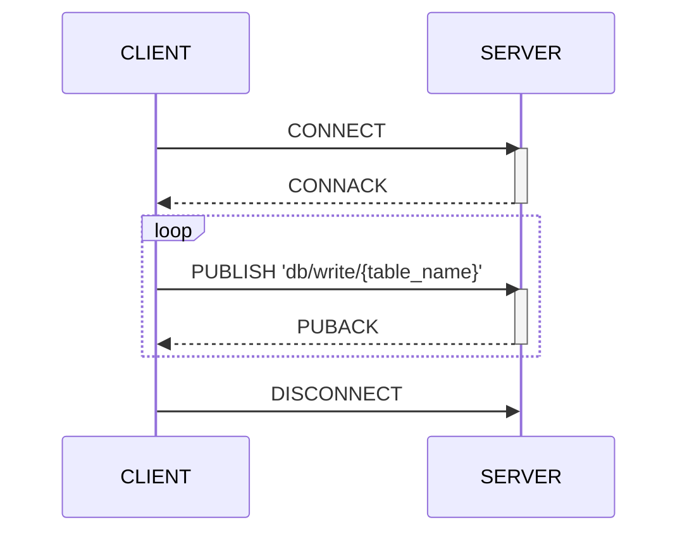
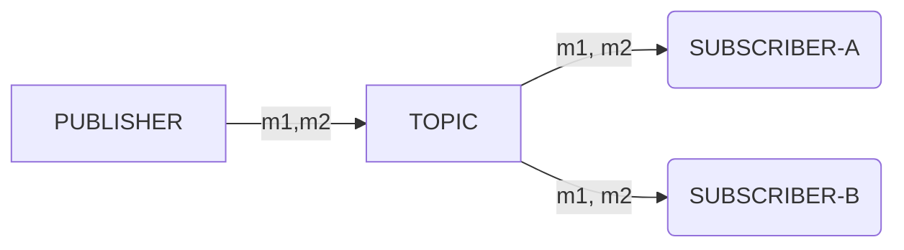
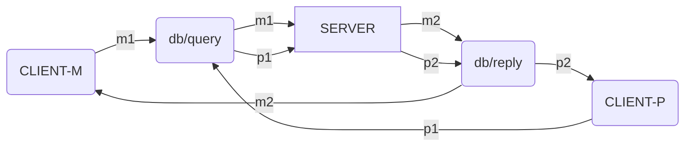
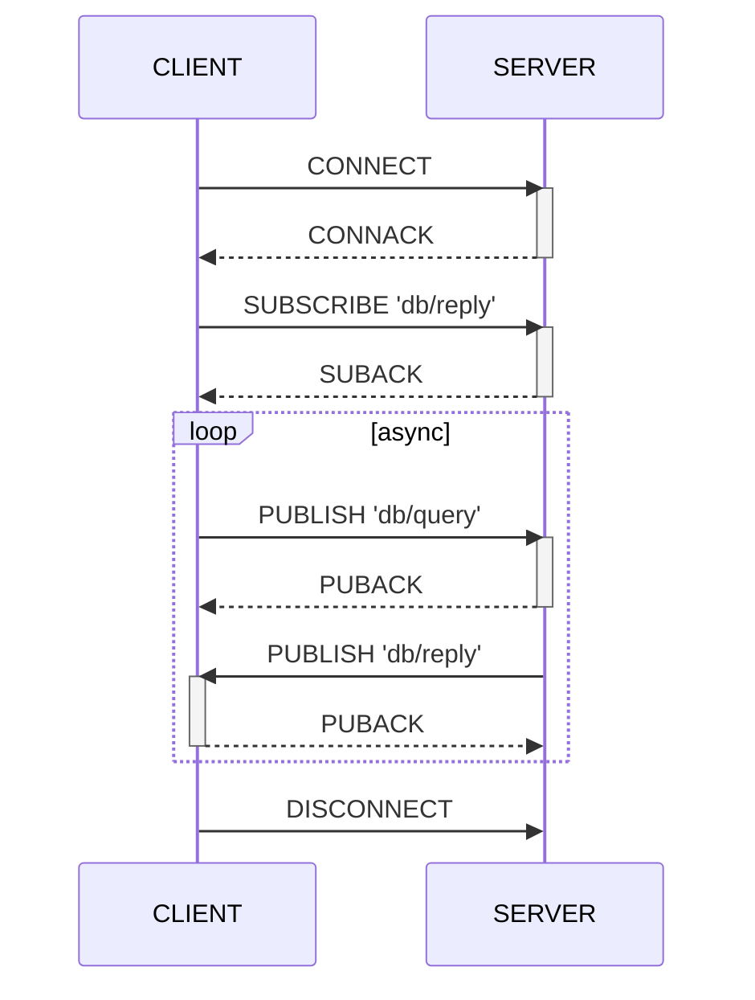

# Machbase Neo MQTT API Guide

Machbase Neo supports writing and query data via MQTT protocols. 

The real benefit of the MQTT API compared to HTTP is that it utilizes the `append` feature of Machbase, which provides robust performance for writing data. Since MQTT is a connection-oriented protocol and maintains a connection throughout the session, clients can repeatedly send messages to write data. Additionally, the MQTT protocol is widely adopted by the majority of IoT devices.

So, using MQTT is the most efficient way for sensors to send their collected data to Machbase Neo.

## Write flow

The examples below shows how to efficiently write data with mqtt client (`mosquitto_pub`).
The destination topic should be `db/write/`+table_name.

## Query flow

General-purpose MQTT brokers deliver messages to all subscribers of a topic, as shown in the diagram below. When a publisher sends messages `M1` and `M2` to the `TOPIC`, both `SUBSCRIBER-A` and `SUBSCRIBER-B` receive the same messages.

Machbase-neo functions similarly to a standard MQTT broker by delivering all messages to subscribers. The exception is the query response message, which is sent only to the client that requested the query. In other words, machbase-neo sends the query result exclusively if the publisher and subscriber share the same connection (or session in MQTT terms). This means that while machbase-neo operates as a message broker, query result messages are not replicated to other subscribers.

For example, while `CLIENT-M` and `CLIENT-P` subscribed to same `TOPIC` and waiting messages.
Server sends messages `M1` and `M2` to `TOPIC` that were inscribed to `CLIENT-M`.
Those messages are delivered only to `CLIENT-M` but `CLIENT-P` receives `P1` and `P2` that were explicitly designated to it by server. If another client `PUBLISHER-X` sends `X1` to `TOPIC`, this `X1` will be delivered to server and the other clients will not know about this event.

Application needs a preparing step to query machbase-neo via MQTT which is subscribing to `db/reply`.
In the diagram below we shows general procedure assuming `CLIENT` uses QoS 1.
for the notes, machbase-neo support QoS 0, 1 of MQTT v3.1.1 specification.

After established MQTT session by exchanging `CONNECT`and `CONNACK`, Client should subscribe to `db/reply` first before send query message to `db/query`, otherwise it can not receive any "query result".

The messages ➍, ➎ are sent by server asynchronous way which is nature of MQTT protocol. Then a client application shouldn't be implemented based specific order of those two messages.

**Note**: If client is only publishing to `db/append` for writing data, it is not necessary to subscribe `db/reply`. This topic is required only for receiving query result.
