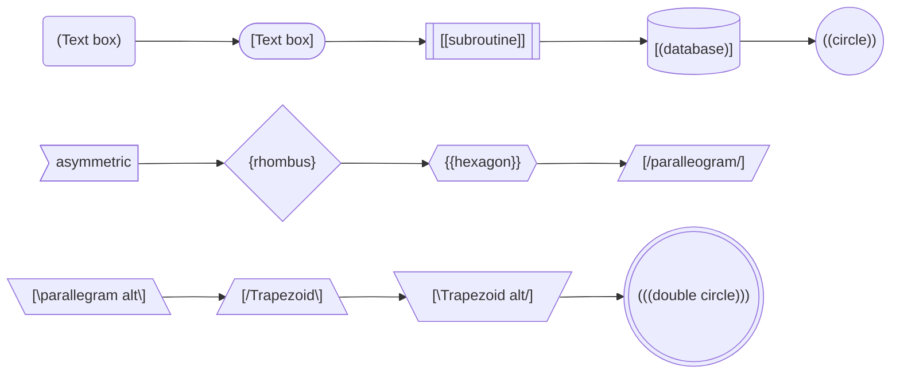

# Flowchart

## Node shapes

```mermaid
flowchart LR
    id1("(Text box)") --> id2(["[Text box]"]) 
    id2 --> id3[["[[subroutine]]"]]
    id3 --> id4[("[(database)]")]
    id4 --> id5(("((circle))"))

    id6>asymmetric] --> id7{"{rhombus}"}
    id7 --> id8{{"{{hexagon}}"}}
    id8 --> id9[/"[/paralleogram/]"/]

    idA[\"[\parallegram alt\]"\] --> idB[/"[/Trapezoid\]"\]
    idB -->idC[\"[\Trapezoid alt/]"/]
    idC -->idD((("(((double circle)))")))
```